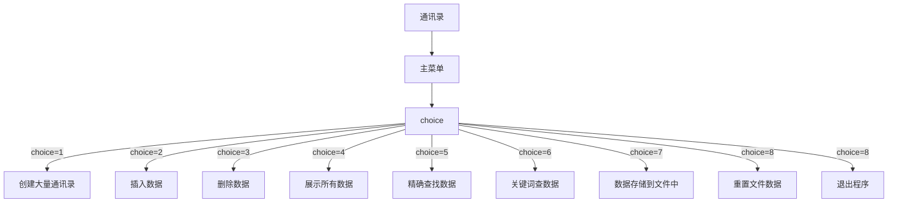

## Comprehensive experiment 1：Application of linear list

## One. Experimental target

1、Use the basic operations to implement the specific operations for the linear table;

2、Master the application of file operations;

3、Improve the understanding of the data structure of linked storage structure, and gradually cultivate the programming ability to solve practical problems.

## Two. Experimental environment

A computer with Visual Studio.

This experiment has 4 class hours in all.

## Three. Experiment content

### 1.    address list design

Design a classmate's address list, requested as follows:

  Each student in the address list contains the following information: student id、name、telephone number. If you need more fields, please add them yourself.

  The program has a main menu containing the following functions:

（1）      Add a record: Add a student record from the input.

（2）      Delete a record: Delete a student record according to the student id from the input.

（3）      Output all records: Display all the records in the address list.

（4）      Search by name: Input the student name and then output the whole information of the student.

（5）      Save records: Save all the records in the address list to a certain file.

（6）      Clear records: Delete all the records in the address list and then delete the file.

（7）      Quit

**hint****：**

 When the program starts, it should be determined whether there is a record file. If the file exists, read each record from it to the list.

 After the user selects and completes a function of the main menu, the program should return to the main menu.

  When a record is added, it should be inserted into the tail of the list.

If a record does not exist when performing delete or and search operation, the program should output some information to the user.

 You do not need to write files when adding records or deleting records.

 When you want to save a record you’d better overwrite the file. (Or delete the original file first, and then save all the records)

 Each module is written in the form of a function, called by the main function.

**optional****：**

Add a sorting function in the main menu, the sorting result should be in an ascending order according to the student number. Sorting methods can be done by bubble sort or insert sort.

## Four.Important data structures

> Important data structures: the structure of linked lists

```c++
typedef struct stu {
	int id;			//id storage student ID
	char name[20];	//storage student name
	int tel;		//storage student telephone
	stu *next;		//Link to the next node
}stu;
```


> Function Main Function and Query

```c++
	cout <<     "|*----------1:Create a large number of contacts-*|\
				 |*----------2:Insert a data---------------------*|\
				 |*----------3:Detele the data-------------------*|\
				 |*----------4:Disply all the Mail list----------*|\
				 |*----------5:Store to the file-----------------*|\
				 |*----------6:Clear the file--------------------*|\
				 |*----------7:Accurate search-------------------*|\
				 |*----------8:rough search----------------------*|\
				 |*----------0:exit------------------------------*|" << endl;
```


> The main operation of address book function

```c++
stu*Create();                       // Bulk creation of data nodes
stu*Insert_(stu*head, stu*p);		// Insert data nodes
stu*Delete_(stu*head, int id);		// Delete data nodes
stu*Display_(stu*head);			// Show all nodes
stu*Find_(stu*head, char name[]);	// Find the required nodes by name
stu*Rough(stu*head, char name[]);	// Rough search, keyword search stu*Store_(stu*head);				// Store in a file
stu*Clear_(stu*head);				// Clear Nodes and Delete Files
int check_data(stu*head, int id, char name[], int tel);//Find out if there is duplicate data, and if there is duplicate data, it will not be stored in the table.

```


## Five.Implementation analysis

### Program Execution Structure Diagram




### Some Detail Function Processing

> **In order to prevent duplication of**
> **storage after reading**, there will be operations to clear the contents of files
> after reading the contents of files to the linked list.

```c++
while(check >> id >> name >> tel)// If there is information in the text read out and stored in the linked list 		
fstream  clear("学生信息.txt", ios::trunc);

```


> **In order to prevent duplicate insertion of the same person's information**, a check function is called every time the information is read from a file or created or inserted by oneself to check whether duplication occurs. If the duplication is not inserted, otherwise the insertion will continue.

```c++
int check_data(stu*head, int id, char name[], int tel)
{
	stu *p;
	for (p = head; p != NULL; p = p->next)
	{
		if (p->id == id && !strcmp(p->name, name) && p->tel == tel)
			return 1;
	}
}
```


#### The Core Code Functions

> Creating a function is just calling the insertion function. In addition, the insertion function can be sorted by id, from small to large.

```c++
stu*Insert_(stu*head, stu*p);	

stu *ptr, *ptr1, *ptr2;// Create two secondary pointers and one pointer to the accepted data

if (head == NULL)			//Judging whether the list is empty
	{
		head = ptr;
		head->next = NULL;
	}

Else
while (ptr->id > ptr2->id&&(ptr2->next != NULL))  // Traverse to find smaller locations than incoming data
		{
	ptr1 = ptr2;	// Recording Locations Finded Using Auxiliary Pointer		
	ptr2 = ptr2->next;
		}
		if (ptr->id <= ptr2->id)						
		{
		if (head == ptr2)	// Find whether the node found is in the header node				head = ptr;
		else
		     ptr1->next = ptr;						// Not Head Node
		ptr1->next = ptr2;		

		}
		else
		{
			ptr2->next = ptr;				// In the smallest case, insert the tail
			ptr->next = NULL;
		}
	}

```


#### **Some bifurcation functions**

> **Branch functions are mostly the work of traversing the list and then doing it.**

Creat:

```C++
stu*Insert_(stu*head, stu*p);// Because creating nodes is also an insertion
function

while (cin >> id && id != 0 && cin >> name >> tel ) // When you input 0 it will break this function 
	{
		p = (stu*)malloc(size);
		p->id = id;
		strcpy(p->name, name);
		p->tel = tel;
		head = Insert_(head, p);  //the main operation
	}

```

Delete：

```C++
struct stu*Delete_(struct stu*head, int id)

stu *ptr1, *ptr2; // Two auxiliary pointers, one for deletion

while (head != NULL && head->id == id)	// If the first one is the data you are looking for
	{
		ptr2 = head;
		head = head->next;
		free(ptr2);
	}
	ptr1 = head;
	ptr2 = head->next;		// Delete the list before and after
while (ptr2->next != NULL)
	{
		if (ptr2->id == id)
		{
			ptr1->next = ptr2->next;
			free(ptr2);					//
		}
		else
			ptr1->next = ptr2;
		ptr2 = ptr1->next;
	}

```

Find：

```C++
stu *Find_(stu*head, char name[])
{
	stu*p;
	for (p = head; p != NULL;p=p->next)     //
	{
		if (!strcmp(p->name, name))
		{
			cout << p->id << " "<<p->name<<" "<<p->tel<<endl;
			return head;
		}
		else
			cout << "can't find it" << endl;
	}
```

Store:

```c++
stu *Store_(stu*head)
{
	fstream  stroe("./学生信息.txt", ios::out);			//
	stu*p;
	for (p = head; p != NULL; p = p->next)
		stroe << p->id << " " << p->name << " " << p->tel << endl;
	cout << "write finish" << endl;
	stroe.close();
	return head;
}
```

Clear:

```C++
stu*Clear_(stu*head)
{

	stu*p;
	fstream  clear("学生信息.txt", ios::trunc);			//Rewrite
	if(remove("学生信息.txt") == 0)						//delete the file
		cout<<"Delete successful"<<endl;
	cout << "clear all finsih" << endl;
	while (head)										//free the list
	{
		p = head;
		p = head->next;
		free(p);
		head = p;
	}
	clear.close();
	return head;
}
```

Display:

```c++
stu *Display_(stu*head)
{
	stu*p;
	if (head == NULL)      //Is it empty?
	{
		cout << "the List is empty" << endl; 
		return NULL;
	}
	for (p = head; p != NULL; p=p->next)   //Traverse the output without being empty
	{
		cout << p->id << " " << p->name << " " << p->tel << endl;
	}
	return head;
}
```


## Six.Debugging problem analysis

#### **One:**

###### Problem:

##### Using goto statements leads to dead loops


###### Solvetion:

##### Cancel the goto statement and replace it with a Boolean function


#### Two:

###### Problem:

###### Failure to return to the header node prevents traversal lookups, etc.


###### Solvetion:

Let each function pass in two parameters, one of which is the header node, so that you can start from scratch each time.


#### Three:

###### Problem:

Failure to check functions results in duplication of functions read from files and data inserted later

###### Solvetion:

1：After reading the data from the file, do a lookup, if repeated, do not add to the linked list, and clean up all the data in the file. 

2：Add a checking function to check whether duplication occurs at the beginning of the list. If duplication occurs, it will not be added to the list.


## Seven.Summary

1:The most difficult part of this project problem is the planning at the beginning. It is very difficult to carry out the next project if the planning is not good. From the requirements, we can get that there are many kinds of requirements in one interface and there is still selectivity. At this time, we think of the switch statement. Every time we ask for the return interface, we think that it is when we return the input value.

2:The most difficult thing is to choose sort insertion when designing, which can be sorted according to the ID created or inserted. At first, the situation is less considered, and insertion often fails. Either the head node is less considered, or the last node is forgotten, and the function after the insertion function is better written.

3:Once again, the problem was pointed out by my classmates. When I emptied the data in the file, there were fewer release nodes. After adding them, I released one node at the end of the program, although the system will release itself.

It's easy to write a program, but it's hard to write a program that takes into account all the situations.


## Eight.Crew Division

| Membername |                         Workdone                          | Completionsituation |
| :--------: | :-------------------------------------------------------: | :-----------------: |
|   徐炜涛   | Programming, Implementation, Document Writing and Summary |                     |

